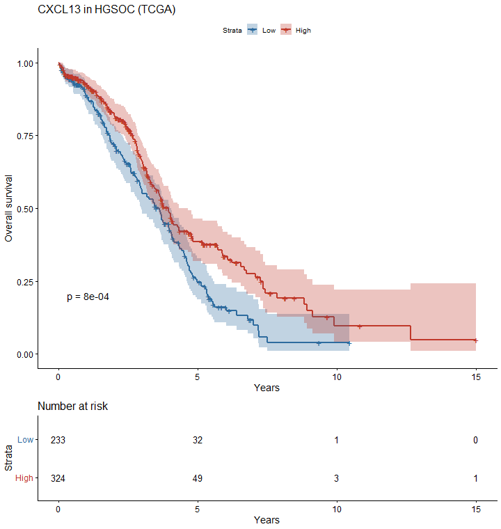

# Biomarker cutoff and survival analysis in ovarian cancer

A small R project that takes a gene expression biomarker and patient survival, finds an optimal cutoff, splits patients into high and low groups, and checks whether the split actually holds up. It runs on the TCGA ovarian cohort from curatedOvarianData, using CXCL13 as the marker.

The goal is to find a cutoff without fooling myself. Picking the threshold that maximises separation between groups inflates significance, so the analysis corrects for that and validates the result instead of trusting the first p-value it sees.

## What it does

1. Loads expression and overall survival for about 570 patients.
2. Finds the best CXCL13 cutpoint with maximally selected rank statistics, reporting the Lausen-Schumacher corrected p-value.
3. Runs a ROC/Youden cutoff for 3-year mortality as a binary comparison.
4. Splits patients into high and low CXCL13 and compares survival with Kaplan-Meier, log-rank, and Cox (univariable and age-adjusted).
5. Validates the cutpoint two ways: a held-out test set and a bootstrap to see how much the threshold moves.

## Results

On 557 patients with 290 deaths and a median follow-up of 2.4 years:

- High CXCL13 patients live longer. Hazard ratio 0.67 (95% CI 0.53 to 0.85), unchanged after adjusting for age. CXCL13 is a known immune marker, so this direction is expected.
- The Kaplan-Meier curves separate clearly through the first six years (log-rank p = 0.0008).
- After correcting for the cutpoint search, the maxstat p-value is 0.059. The effect is real in direction but sits at the edge of significance once you account for scanning every possible threshold.
- The bootstrap picks a cutpoint near 3.8 most of the time, so the threshold is fairly stable.
- The 3-year ROC has an AUC of 0.55. Collapsing survival into a single time point throws away most of the signal, which is why the survival cutoff is the main analysis and the ROC is secondary.

CXCL13 carries real, age-independent prognostic information, but a single cutpoint is not strong enough to use as a clinical threshold without more data.

## Running it

    source("biomarker_cutoff.R")

The first run needs curatedOvarianData from Bioconductor and a few CRAN stats packages:

    if (!requireNamespace("BiocManager", quietly = TRUE)) install.packages("BiocManager")
    BiocManager::install("curatedOvarianData")

Figures and tables are written to a results folder.

## Reusing it

The code is written as functions, so swapping the marker or cohort is one line:

    dat <- load_cohort("CD8A")

## Method note

The optimal cutpoint problem is well known to inflate significance (Altman et al., JNCI 1994). The corrected p-value, the held-out test, and the bootstrap are there to push back against that.

## License

MIT
